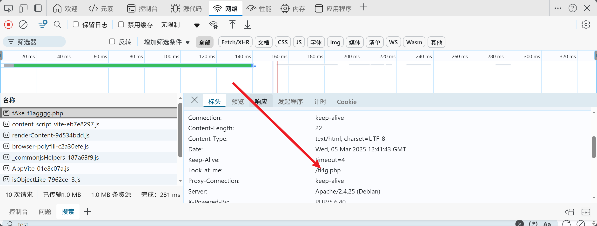

# 一.前言
本文涉及<br />
intval 、md5弱比较 、cat的替代品 、空格的替代品
# 二.题目名称
[WUSTCTF2020]朴实无华
# 三.重要步骤的解题过程
## 1.找到源码
打开文件后先用dirsearch扫了一下目录，扫到了robots.txt<br />
然后这个步骤我得记录一下，当时做的时候是真的没有想到<br />
打开f12中的网络，抓一下包，发现这个包里面还有一个网址<br />
<br />
再次打开才出现了php代码
## 2.php代码审计
这里直接把源码贴出来
```declarative
<?php
header('Content-type:text/html;charset=utf-8');
error_reporting(0);
highlight_file(__file__);


//level 1
if (isset($_GET['num'])){
    $num = $_GET['num'];
    if(intval($num) < 2020 && intval($num + 1) > 2021){
        echo "我不经意间看了看我的劳力士, 不是想看时间, 只是想不经意间, 让你知道我过得比你好.</br>";
    }else{
        die("金钱解决不了穷人的本质问题");
    }
}else{
    die("去非洲吧");
}
//level 2
if (isset($_GET['md5'])){
   $md5=$_GET['md5'];
   if ($md5==md5($md5))
       echo "想到这个CTFer拿到flag后, 感激涕零, 跑去东澜岸, 找一家餐厅, 把厨师轰出去, 自己炒两个拿手小菜, 倒一杯散装白酒, 致富有道, 别学小暴.</br>";
   else
       die("我赶紧喊来我的酒肉朋友, 他打了个电话, 把他一家安排到了非洲");
}else{
    die("去非洲吧");
}

//get flag
if (isset($_GET['get_flag'])){
    $get_flag = $_GET['get_flag'];
    if(!strstr($get_flag," ")){
        $get_flag = str_ireplace("cat", "wctf2020", $get_flag);
        echo "想到这里, 我充实而欣慰, 有钱人的快乐往往就是这么的朴实无华, 且枯燥.</br>";
        system($get_flag);
    }else{
        die("快到非洲了");
    }
}else{
    die("去非洲吧");
}
?>
```
### 1.intval的绕过
`intval`可以使用`科学计数法`来绕过，比如num=11e3 ，但是此方法只适用于php7.0以下的版本<br />
intval(11e3)，会自动被强制转化为int类型，即11。但是当运算时，会先把科学技术法解析，然后再运算，intval(11e3+1)，则会结果为11001.<br />
实现绕过
### 2.md5弱比较
这里记一下吧，md5加密后还是本身的数，`0e215962017`
### 3.cat的替代品
more 、less 、tail 、head 、sort 、ca\t
### 4.空格的替代品
```
$IFS
${IFS}
$IFS$1
$IFS$9
```
